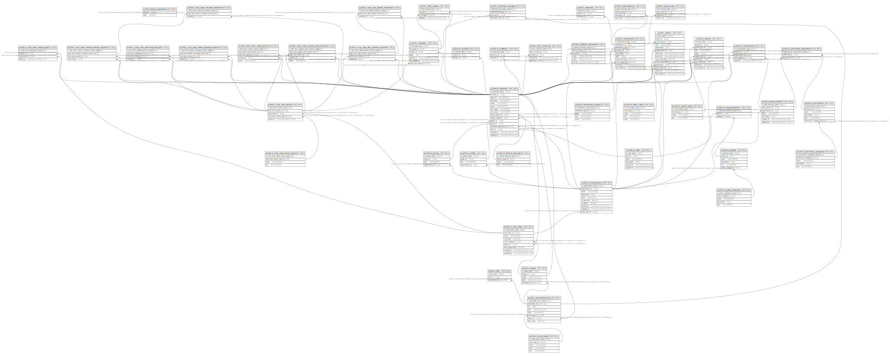

# mono_recs_seem

## Tables

| Name | Columns | Comment | Type |
| ---- | ------- | ------- | ---- |
| [public.schema_migrations](public.schema_migrations.md) | 2 |  | BASE TABLE |
| [public.m_policy_categories](public.m_policy_categories.md) | 5 |  | BASE TABLE |
| [public.m_policies](public.m_policies.md) | 6 |  | BASE TABLE |
| [public.m_roles](public.m_roles.md) | 6 |  | BASE TABLE |
| [public.m_role_associations](public.m_role_associations.md) | 3 |  | BASE TABLE |
| [public.m_attend_statuses](public.m_attend_statuses.md) | 4 |  | BASE TABLE |
| [public.m_organizations](public.m_organizations.md) | 10 |  | BASE TABLE |
| [public.m_permission_categories](public.m_permission_categories.md) | 5 |  | BASE TABLE |
| [public.m_work_positions](public.m_work_positions.md) | 7 |  | BASE TABLE |
| [public.m_permissions](public.m_permissions.md) | 6 |  | BASE TABLE |
| [public.m_permission_associations](public.m_permission_associations.md) | 3 |  | BASE TABLE |
| [public.m_groups](public.m_groups.md) | 4 |  | BASE TABLE |
| [public.m_grades](public.m_grades.md) | 4 |  | BASE TABLE |
| [public.m_mime_types](public.m_mime_types.md) | 5 |  | BASE TABLE |
| [public.t_attachable_items](public.t_attachable_items.md) | 8 |  | BASE TABLE |
| [public.t_images](public.t_images.md) | 5 |  | BASE TABLE |
| [public.t_files](public.t_files.md) | 3 |  | BASE TABLE |
| [public.m_members](public.m_members.md) | 16 |  | BASE TABLE |
| [public.m_students](public.m_students.md) | 3 |  | BASE TABLE |
| [public.m_professors](public.m_professors.md) | 3 |  | BASE TABLE |
| [public.m_event_types](public.m_event_types.md) | 5 |  | BASE TABLE |
| [public.t_events](public.t_events.md) | 14 |  | BASE TABLE |
| [public.m_attendance_types](public.m_attendance_types.md) | 5 |  | BASE TABLE |
| [public.t_attendances](public.t_attendances.md) | 10 |  | BASE TABLE |
| [public.t_early_leavings](public.t_early_leavings.md) | 4 |  | BASE TABLE |
| [public.t_late_arrivals](public.t_late_arrivals.md) | 4 |  | BASE TABLE |
| [public.t_absences](public.t_absences.md) | 3 |  | BASE TABLE |
| [public.t_lab_io_histories](public.t_lab_io_histories.md) | 5 |  | BASE TABLE |
| [public.m_chat_rooms](public.m_chat_rooms.md) | 9 |  | BASE TABLE |
| [public.t_messages](public.t_messages.md) | 8 |  | BASE TABLE |
| [public.t_position_histories](public.t_position_histories.md) | 6 |  | BASE TABLE |
| [public.m_chat_room_belongings](public.m_chat_room_belongings.md) | 4 |  | BASE TABLE |
| [public.m_record_types](public.m_record_types.md) | 4 |  | BASE TABLE |
| [public.t_records](public.t_records.md) | 10 |  | BASE TABLE |
| [public.t_attached_messages](public.t_attached_messages.md) | 4 |  | BASE TABLE |
| [public.t_read_receipts](public.t_read_receipts.md) | 4 |  | BASE TABLE |
| [public.m_memberships](public.m_memberships.md) | 5 |  | BASE TABLE |
| [public.m_chat_room_action_types](public.m_chat_room_action_types.md) | 4 |  | BASE TABLE |
| [public.t_chat_room_actions](public.t_chat_room_actions.md) | 4 |  | BASE TABLE |
| [public.t_chat_room_create_actions](public.t_chat_room_create_actions.md) | 5 |  | BASE TABLE |
| [public.t_chat_room_update_name_actions](public.t_chat_room_update_name_actions.md) | 5 |  | BASE TABLE |
| [public.t_chat_room_add_member_actions](public.t_chat_room_add_member_actions.md) | 4 |  | BASE TABLE |
| [public.t_chat_room_remove_member_actions](public.t_chat_room_remove_member_actions.md) | 4 |  | BASE TABLE |
| [public.t_chat_room_withdraw_actions](public.t_chat_room_withdraw_actions.md) | 4 |  | BASE TABLE |
| [public.t_chat_room_added_members](public.t_chat_room_added_members.md) | 3 |  | BASE TABLE |
| [public.t_chat_room_removed_members](public.t_chat_room_removed_members.md) | 3 |  | BASE TABLE |

## Stored procedures and functions

| Name | ReturnType | Arguments | Type |
| ---- | ------- | ------- | ---- |
| public.uuid_nil | uuid |  | FUNCTION |
| public.uuid_ns_dns | uuid |  | FUNCTION |
| public.uuid_ns_url | uuid |  | FUNCTION |
| public.uuid_ns_oid | uuid |  | FUNCTION |
| public.uuid_ns_x500 | uuid |  | FUNCTION |
| public.uuid_generate_v1 | uuid |  | FUNCTION |
| public.uuid_generate_v1mc | uuid |  | FUNCTION |
| public.uuid_generate_v3 | uuid | namespace uuid, name text | FUNCTION |
| public.uuid_generate_v4 | uuid |  | FUNCTION |
| public.uuid_generate_v5 | uuid | namespace uuid, name text | FUNCTION |

## Relations

---

> Generated by [tbls](https://github.com/k1LoW/tbls)
