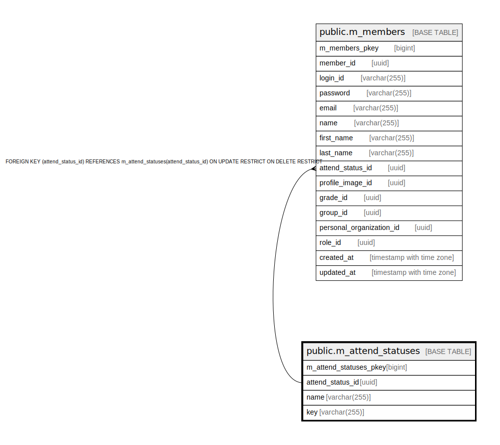

# public.m_attend_statuses

## Description

## Columns

| Name | Type | Default | Nullable | Children | Parents | Comment |
| ---- | ---- | ------- | -------- | -------- | ------- | ------- |
| m_attend_statuses_pkey | bigint | nextval('m_attend_statuses_m_attend_statuses_pkey_seq'::regclass) | false |  |  |  |
| attend_status_id | uuid | uuid_generate_v4() | false | [public.m_members](public.m_members.md) |  |  |
| name | varchar(255) |  | false |  |  |  |
| key | varchar(255) |  | false |  |  |  |

## Constraints

| Name | Type | Definition |
| ---- | ---- | ---------- |
| m_attend_statuses_pkey | PRIMARY KEY | PRIMARY KEY (m_attend_statuses_pkey) |

## Indexes

| Name | Definition |
| ---- | ---------- |
| m_attend_statuses_pkey | CREATE UNIQUE INDEX m_attend_statuses_pkey ON public.m_attend_statuses USING btree (m_attend_statuses_pkey) |
| idx_m_attend_statuses_id | CREATE UNIQUE INDEX idx_m_attend_statuses_id ON public.m_attend_statuses USING btree (attend_status_id) |
| idx_m_attend_statuses_key | CREATE UNIQUE INDEX idx_m_attend_statuses_key ON public.m_attend_statuses USING btree (key) |

## Relations

---

> Generated by [tbls](https://github.com/k1LoW/tbls)
