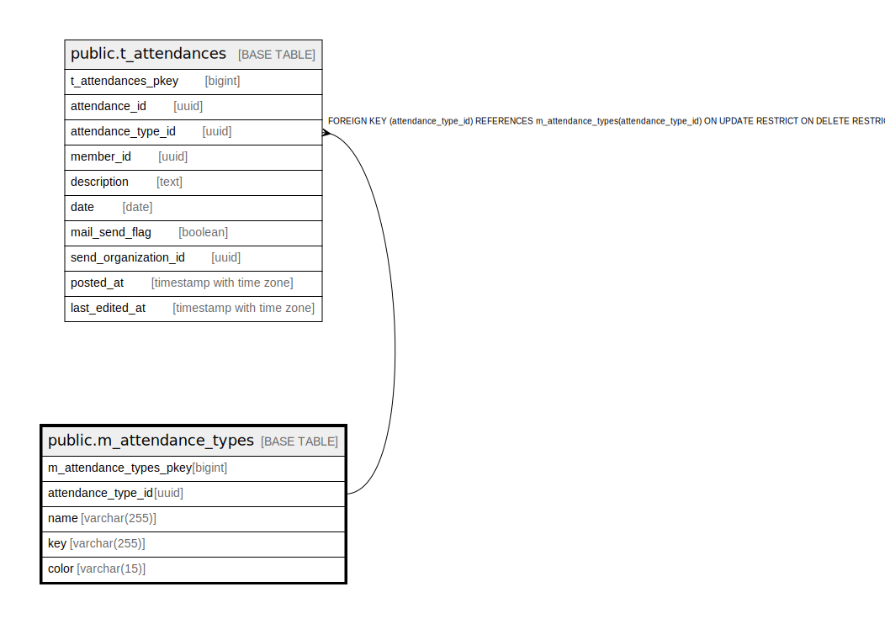

# public.m_attendance_types

## Description

## Columns

| Name | Type | Default | Nullable | Children | Parents | Comment |
| ---- | ---- | ------- | -------- | -------- | ------- | ------- |
| m_attendance_types_pkey | bigint | nextval('m_attendance_types_m_attendance_types_pkey_seq'::regclass) | false |  |  |  |
| attendance_type_id | uuid | uuid_generate_v4() | false | [public.t_attendances](public.t_attendances.md) |  |  |
| name | varchar(255) |  | false |  |  |  |
| key | varchar(255) |  | false |  |  |  |
| color | varchar(15) |  | false |  |  |  |

## Constraints

| Name | Type | Definition |
| ---- | ---- | ---------- |
| m_attendance_types_pkey | PRIMARY KEY | PRIMARY KEY (m_attendance_types_pkey) |

## Indexes

| Name | Definition |
| ---- | ---------- |
| m_attendance_types_pkey | CREATE UNIQUE INDEX m_attendance_types_pkey ON public.m_attendance_types USING btree (m_attendance_types_pkey) |
| idx_m_attendance_types_id | CREATE UNIQUE INDEX idx_m_attendance_types_id ON public.m_attendance_types USING btree (attendance_type_id) |
| idx_m_attendance_types_key | CREATE UNIQUE INDEX idx_m_attendance_types_key ON public.m_attendance_types USING btree (key) |

## Relations

---

> Generated by [tbls](https://github.com/k1LoW/tbls)
