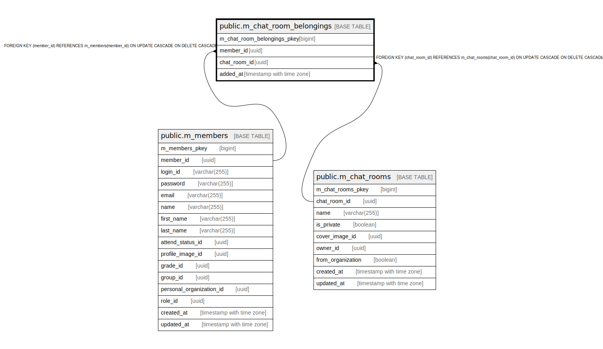

# public.m_chat_room_belongings

## Description

## Columns

| Name | Type | Default | Nullable | Children | Parents | Comment |
| ---- | ---- | ------- | -------- | -------- | ------- | ------- |
| m_chat_room_belongings_pkey | bigint | nextval('m_chat_room_belongings_m_chat_room_belongings_pkey_seq'::regclass) | false |  |  |  |
| member_id | uuid |  | false |  | [public.m_members](public.m_members.md) |  |
| chat_room_id | uuid |  | false |  | [public.m_chat_rooms](public.m_chat_rooms.md) |  |
| added_at | timestamp with time zone |  | false |  |  |  |

## Constraints

| Name | Type | Definition |
| ---- | ---- | ---------- |
| fk_m_chat_room_belongings_member_id | FOREIGN KEY | FOREIGN KEY (member_id) REFERENCES m_members(member_id) ON UPDATE CASCADE ON DELETE CASCADE |
| fk_m_chat_room_belongings_chat_room_id | FOREIGN KEY | FOREIGN KEY (chat_room_id) REFERENCES m_chat_rooms(chat_room_id) ON UPDATE CASCADE ON DELETE CASCADE |
| m_chat_room_belongings_pkey | PRIMARY KEY | PRIMARY KEY (m_chat_room_belongings_pkey) |

## Indexes

| Name | Definition |
| ---- | ---------- |
| m_chat_room_belongings_pkey | CREATE UNIQUE INDEX m_chat_room_belongings_pkey ON public.m_chat_room_belongings USING btree (m_chat_room_belongings_pkey) |
| idx_m_chat_room_belongings_id | CREATE UNIQUE INDEX idx_m_chat_room_belongings_id ON public.m_chat_room_belongings USING btree (member_id, chat_room_id) |

## Relations

---

> Generated by [tbls](https://github.com/k1LoW/tbls)
