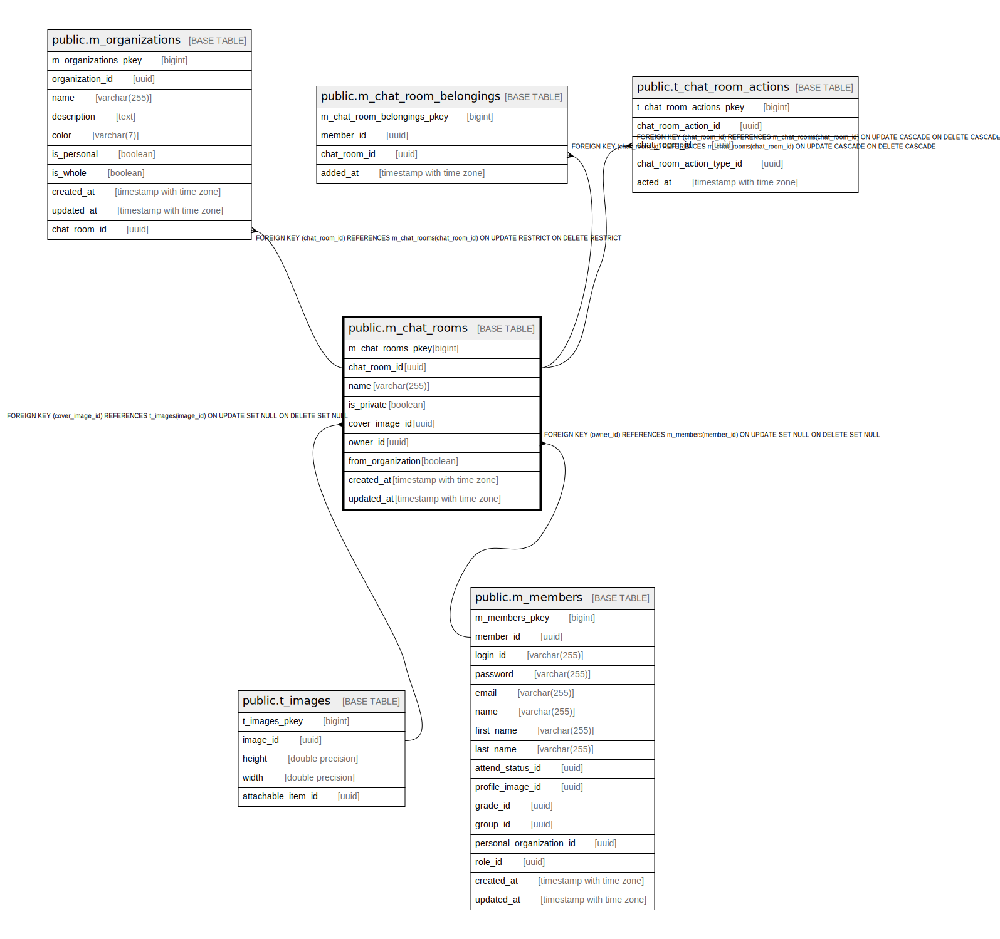

# public.m_chat_rooms

## Description

## Columns

| Name | Type | Default | Nullable | Children | Parents | Comment |
| ---- | ---- | ------- | -------- | -------- | ------- | ------- |
| m_chat_rooms_pkey | bigint | nextval('m_chat_rooms_m_chat_rooms_pkey_seq'::regclass) | false |  |  |  |
| chat_room_id | uuid | uuid_generate_v4() | false | [public.t_messages](public.t_messages.md) [public.m_chat_room_belongings](public.m_chat_room_belongings.md) |  |  |
| name | varchar(255) |  | true |  |  |  |
| is_private | boolean |  | false |  |  |  |
| cover_image_id | uuid |  | true |  | [public.t_images](public.t_images.md) |  |
| owner_id | uuid |  | true |  | [public.m_members](public.m_members.md) |  |
| created_at | timestamp with time zone |  | false |  |  |  |
| updated_at | timestamp with time zone |  | false |  |  |  |

## Constraints

| Name | Type | Definition |
| ---- | ---- | ---------- |
| fk_m_chat_rooms_cover_image_id | FOREIGN KEY | FOREIGN KEY (cover_image_id) REFERENCES t_images(image_id) ON UPDATE SET NULL ON DELETE SET NULL |
| fk_m_chat_rooms_owner_id | FOREIGN KEY | FOREIGN KEY (owner_id) REFERENCES m_members(member_id) ON UPDATE SET NULL ON DELETE SET NULL |
| m_chat_rooms_pkey | PRIMARY KEY | PRIMARY KEY (m_chat_rooms_pkey) |

## Indexes

| Name | Definition |
| ---- | ---------- |
| m_chat_rooms_pkey | CREATE UNIQUE INDEX m_chat_rooms_pkey ON public.m_chat_rooms USING btree (m_chat_rooms_pkey) |
| idx_m_chat_rooms_id | CREATE UNIQUE INDEX idx_m_chat_rooms_id ON public.m_chat_rooms USING btree (chat_room_id) |

## Relations

---

> Generated by [tbls](https://github.com/k1LoW/tbls)
