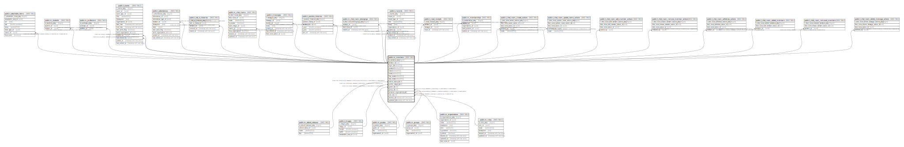

# public.m_members

## Description

## Columns

| Name | Type | Default | Nullable | Children | Parents | Comment |
| ---- | ---- | ------- | -------- | -------- | ------- | ------- |
| m_members_pkey | bigint | nextval('m_members_m_members_pkey_seq'::regclass) | false |  |  |  |
| member_id | uuid | uuid_generate_v4() | false | [public.m_students](public.m_students.md) [public.m_professors](public.m_professors.md) [public.t_events](public.t_events.md) [public.t_attendances](public.t_attendances.md) [public.t_lab_io_histories](public.t_lab_io_histories.md) [public.m_chat_rooms](public.m_chat_rooms.md) [public.t_messages](public.t_messages.md) [public.t_position_histories](public.t_position_histories.md) [public.m_chat_room_belongings](public.m_chat_room_belongings.md) [public.t_records](public.t_records.md) |  |  |
| login_id | varchar(255) |  | false |  |  |  |
| password | varchar(255) |  | false |  |  |  |
| email | varchar(255) |  | false |  |  |  |
| name | varchar(255) |  | false |  |  |  |
| attend_status_id | uuid |  | false |  | [public.m_attend_statuses](public.m_attend_statuses.md) |  |
| profile_image_id | uuid |  | true |  | [public.t_images](public.t_images.md) |  |
| grade_id | uuid |  | false |  | [public.m_grades](public.m_grades.md) |  |
| group_id | uuid |  | false |  | [public.m_groups](public.m_groups.md) |  |
| personal_organization_id | uuid |  | false |  | [public.m_organizations](public.m_organizations.md) |  |
| role_id | uuid |  | true |  | [public.m_roles](public.m_roles.md) |  |
| created_at | timestamp with time zone |  | false |  |  |  |
| updated_at | timestamp with time zone |  | false |  |  |  |

## Constraints

| Name | Type | Definition |
| ---- | ---- | ---------- |
| fk_m_members_role_id | FOREIGN KEY | FOREIGN KEY (role_id) REFERENCES m_roles(role_id) ON UPDATE SET NULL ON DELETE SET NULL |
| fk_m_members_attend_status_id | FOREIGN KEY | FOREIGN KEY (attend_status_id) REFERENCES m_attend_statuses(attend_status_id) ON UPDATE RESTRICT ON DELETE RESTRICT |
| fk_m_members_personal_organization_id | FOREIGN KEY | FOREIGN KEY (personal_organization_id) REFERENCES m_organizations(organization_id) ON UPDATE RESTRICT ON DELETE RESTRICT |
| fk_m_members_group_id | FOREIGN KEY | FOREIGN KEY (group_id) REFERENCES m_groups(group_id) ON UPDATE RESTRICT ON DELETE RESTRICT |
| fk_m_members_grade_id | FOREIGN KEY | FOREIGN KEY (grade_id) REFERENCES m_grades(grade_id) ON UPDATE RESTRICT ON DELETE RESTRICT |
| fk_m_members_profile_image_id | FOREIGN KEY | FOREIGN KEY (profile_image_id) REFERENCES t_images(image_id) ON UPDATE SET NULL ON DELETE SET NULL |
| m_members_pkey | PRIMARY KEY | PRIMARY KEY (m_members_pkey) |

## Indexes

| Name | Definition |
| ---- | ---------- |
| m_members_pkey | CREATE UNIQUE INDEX m_members_pkey ON public.m_members USING btree (m_members_pkey) |
| idx_m_members_id | CREATE UNIQUE INDEX idx_m_members_id ON public.m_members USING btree (member_id) |
| idx_m_members_login_id | CREATE UNIQUE INDEX idx_m_members_login_id ON public.m_members USING btree (login_id) |

## Relations

---

> Generated by [tbls](https://github.com/k1LoW/tbls)
