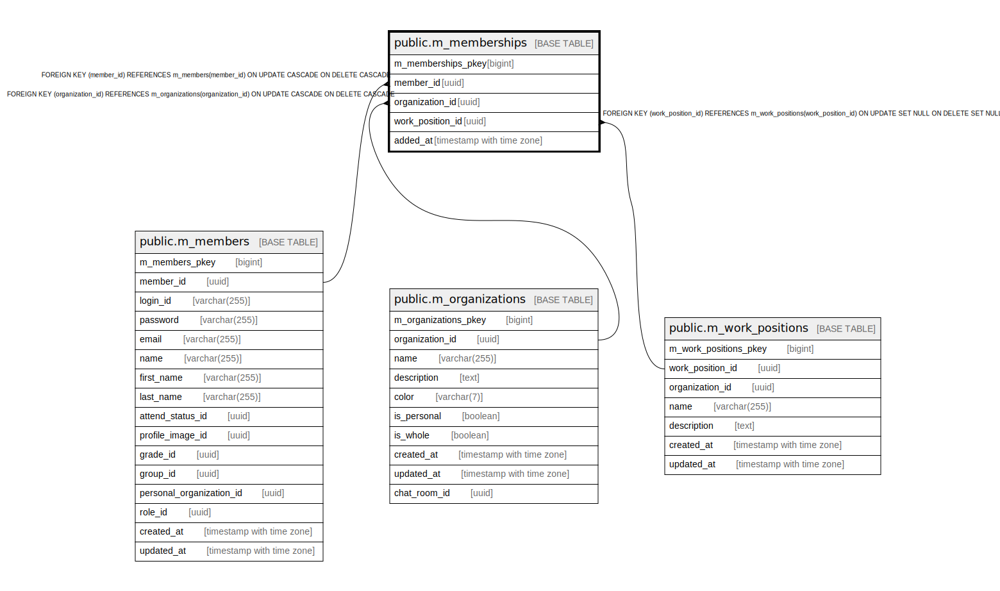

# public.m_memberships

## Description

## Columns

| Name | Type | Default | Nullable | Children | Parents | Comment |
| ---- | ---- | ------- | -------- | -------- | ------- | ------- |
| m_memberships_pkey | bigint | nextval('m_memberships_m_memberships_pkey_seq'::regclass) | false |  |  |  |
| member_id | uuid |  | false |  | [public.m_members](public.m_members.md) |  |
| organization_id | uuid |  | false |  | [public.m_organizations](public.m_organizations.md) |  |
| work_position_id | uuid |  | true |  | [public.m_work_positions](public.m_work_positions.md) |  |
| added_at | timestamp with time zone |  | false |  |  |  |

## Constraints

| Name | Type | Definition |
| ---- | ---- | ---------- |
| fk_m_memberships_organization_id | FOREIGN KEY | FOREIGN KEY (organization_id) REFERENCES m_organizations(organization_id) ON UPDATE CASCADE ON DELETE CASCADE |
| fk_m_memberships_work_position_id | FOREIGN KEY | FOREIGN KEY (work_position_id) REFERENCES m_work_positions(work_position_id) ON UPDATE SET NULL ON DELETE SET NULL |
| fk_m_memberships_member_id | FOREIGN KEY | FOREIGN KEY (member_id) REFERENCES m_members(member_id) ON UPDATE CASCADE ON DELETE CASCADE |
| m_memberships_pkey | PRIMARY KEY | PRIMARY KEY (m_memberships_pkey) |

## Indexes

| Name | Definition |
| ---- | ---------- |
| m_memberships_pkey | CREATE UNIQUE INDEX m_memberships_pkey ON public.m_memberships USING btree (m_memberships_pkey) |
| idx_m_memberships_id | CREATE UNIQUE INDEX idx_m_memberships_id ON public.m_memberships USING btree (member_id, organization_id) |

## Relations

---

> Generated by [tbls](https://github.com/k1LoW/tbls)
