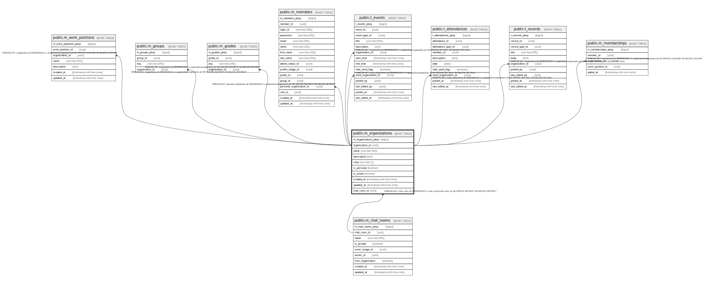

# public.m_organizations

## Description

## Columns

| Name | Type | Default | Nullable | Children | Parents | Comment |
| ---- | ---- | ------- | -------- | -------- | ------- | ------- |
| m_organizations_pkey | bigint | nextval('m_organizations_m_organizations_pkey_seq'::regclass) | false |  |  |  |
| organization_id | uuid | uuid_generate_v4() | false | [public.m_groups](public.m_groups.md) [public.m_grades](public.m_grades.md) [public.m_members](public.m_members.md) [public.t_events](public.t_events.md) [public.t_attendances](public.t_attendances.md) [public.t_records](public.t_records.md) |  |  |
| name | varchar(255) |  | false |  |  |  |
| description | text |  | true |  |  |  |
| is_personal | boolean | false | false |  |  |  |
| is_whole | boolean | false | false |  |  |  |
| created_at | timestamp with time zone |  | false |  |  |  |
| updated_at | timestamp with time zone |  | false |  |  |  |

## Constraints

| Name | Type | Definition |
| ---- | ---- | ---------- |
| m_organizations_pkey | PRIMARY KEY | PRIMARY KEY (m_organizations_pkey) |

## Indexes

| Name | Definition |
| ---- | ---------- |
| m_organizations_pkey | CREATE UNIQUE INDEX m_organizations_pkey ON public.m_organizations USING btree (m_organizations_pkey) |
| idx_m_organizations_id | CREATE UNIQUE INDEX idx_m_organizations_id ON public.m_organizations USING btree (organization_id) |
| idx_m_organizations_name | CREATE UNIQUE INDEX idx_m_organizations_name ON public.m_organizations USING btree (name) |

## Relations

---

> Generated by [tbls](https://github.com/k1LoW/tbls)
