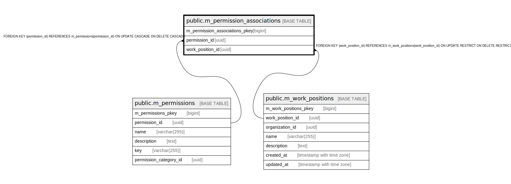

# public.m_permission_associations

## Description

## Columns

| Name | Type | Default | Nullable | Children | Parents | Comment |
| ---- | ---- | ------- | -------- | -------- | ------- | ------- |
| m_permission_associations_pkey | bigint | nextval('m_permission_associations_m_permission_associations_pkey_seq'::regclass) | false |  |  |  |
| permission_id | uuid |  | false |  | [public.m_permissions](public.m_permissions.md) |  |
| work_position_id | uuid |  | false |  | [public.m_work_positions](public.m_work_positions.md) |  |

## Constraints

| Name | Type | Definition |
| ---- | ---- | ---------- |
| fk_m_permission_associations_work_position_id | FOREIGN KEY | FOREIGN KEY (work_position_id) REFERENCES m_work_positions(work_position_id) ON UPDATE RESTRICT ON DELETE RESTRICT |
| fk_m_permission_associations_permission_id | FOREIGN KEY | FOREIGN KEY (permission_id) REFERENCES m_permissions(permission_id) ON UPDATE CASCADE ON DELETE CASCADE |
| m_permission_associations_pkey | PRIMARY KEY | PRIMARY KEY (m_permission_associations_pkey) |

## Indexes

| Name | Definition |
| ---- | ---------- |
| m_permission_associations_pkey | CREATE UNIQUE INDEX m_permission_associations_pkey ON public.m_permission_associations USING btree (m_permission_associations_pkey) |
| idx_m_permission_associations_id | CREATE UNIQUE INDEX idx_m_permission_associations_id ON public.m_permission_associations USING btree (permission_id, work_position_id) |

## Relations

---

> Generated by [tbls](https://github.com/k1LoW/tbls)
