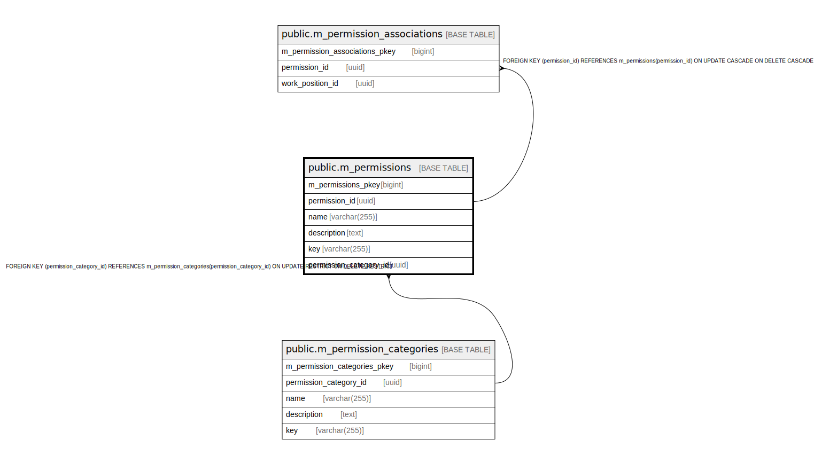

# public.m_permissions

## Description

## Columns

| Name | Type | Default | Nullable | Children | Parents | Comment |
| ---- | ---- | ------- | -------- | -------- | ------- | ------- |
| m_permissions_pkey | bigint | nextval('m_permissions_m_permissions_pkey_seq'::regclass) | false |  |  |  |
| permission_id | uuid | uuid_generate_v4() | false | [public.m_permission_associations](public.m_permission_associations.md) |  |  |
| name | varchar(255) |  | false |  |  |  |
| description | text |  | false |  |  |  |
| key | varchar(255) |  | false |  |  |  |
| permission_category_id | uuid |  | false |  | [public.m_permission_categories](public.m_permission_categories.md) |  |

## Constraints

| Name | Type | Definition |
| ---- | ---- | ---------- |
| fk_m_permissions_permission_category_id | FOREIGN KEY | FOREIGN KEY (permission_category_id) REFERENCES m_permission_categories(permission_category_id) ON UPDATE RESTRICT ON DELETE RESTRICT |
| m_permissions_pkey | PRIMARY KEY | PRIMARY KEY (m_permissions_pkey) |

## Indexes

| Name | Definition |
| ---- | ---------- |
| m_permissions_pkey | CREATE UNIQUE INDEX m_permissions_pkey ON public.m_permissions USING btree (m_permissions_pkey) |
| idx_m_permissions_id | CREATE UNIQUE INDEX idx_m_permissions_id ON public.m_permissions USING btree (permission_id) |
| idx_m_permissions_key | CREATE UNIQUE INDEX idx_m_permissions_key ON public.m_permissions USING btree (key) |

## Relations

---

> Generated by [tbls](https://github.com/k1LoW/tbls)
