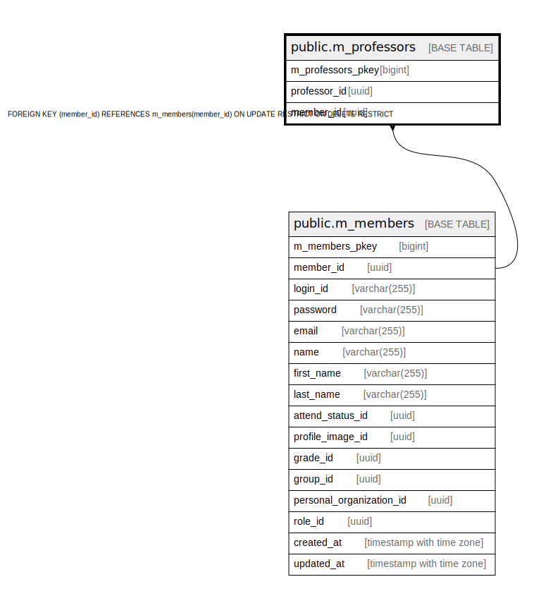

# public.m_professors

## Description

## Columns

| Name | Type | Default | Nullable | Children | Parents | Comment |
| ---- | ---- | ------- | -------- | -------- | ------- | ------- |
| m_professors_pkey | bigint | nextval('m_professors_m_professors_pkey_seq'::regclass) | false |  |  |  |
| professor_id | uuid | uuid_generate_v4() | false |  |  |  |
| member_id | uuid |  | false |  | [public.m_members](public.m_members.md) |  |

## Constraints

| Name | Type | Definition |
| ---- | ---- | ---------- |
| fk_m_professors_member_id | FOREIGN KEY | FOREIGN KEY (member_id) REFERENCES m_members(member_id) ON UPDATE RESTRICT ON DELETE RESTRICT |
| m_professors_pkey | PRIMARY KEY | PRIMARY KEY (m_professors_pkey) |

## Indexes

| Name | Definition |
| ---- | ---------- |
| m_professors_pkey | CREATE UNIQUE INDEX m_professors_pkey ON public.m_professors USING btree (m_professors_pkey) |
| idx_m_professors_id | CREATE UNIQUE INDEX idx_m_professors_id ON public.m_professors USING btree (professor_id) |

## Relations

---

> Generated by [tbls](https://github.com/k1LoW/tbls)
