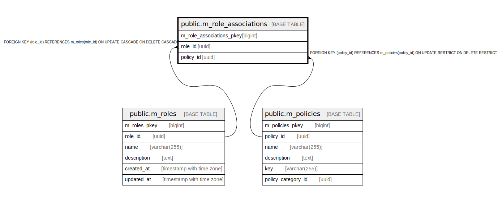

# public.m_role_associations

## Description

## Columns

| Name | Type | Default | Nullable | Children | Parents | Comment |
| ---- | ---- | ------- | -------- | -------- | ------- | ------- |
| m_role_associations_pkey | bigint | nextval('m_role_associations_m_role_associations_pkey_seq'::regclass) | false |  |  |  |
| role_id | uuid |  | false |  | [public.m_roles](public.m_roles.md) |  |
| policy_id | uuid |  | false |  | [public.m_policies](public.m_policies.md) |  |

## Constraints

| Name | Type | Definition |
| ---- | ---- | ---------- |
| fk_m_role_associations_policy_id | FOREIGN KEY | FOREIGN KEY (policy_id) REFERENCES m_policies(policy_id) ON UPDATE RESTRICT ON DELETE RESTRICT |
| fk_m_role_associations_role_id | FOREIGN KEY | FOREIGN KEY (role_id) REFERENCES m_roles(role_id) ON UPDATE CASCADE ON DELETE CASCADE |
| m_role_associations_pkey | PRIMARY KEY | PRIMARY KEY (m_role_associations_pkey) |

## Indexes

| Name | Definition |
| ---- | ---------- |
| m_role_associations_pkey | CREATE UNIQUE INDEX m_role_associations_pkey ON public.m_role_associations USING btree (m_role_associations_pkey) |
| idx_m_role_associations_id | CREATE UNIQUE INDEX idx_m_role_associations_id ON public.m_role_associations USING btree (role_id, policy_id) |

## Relations

---

> Generated by [tbls](https://github.com/k1LoW/tbls)
