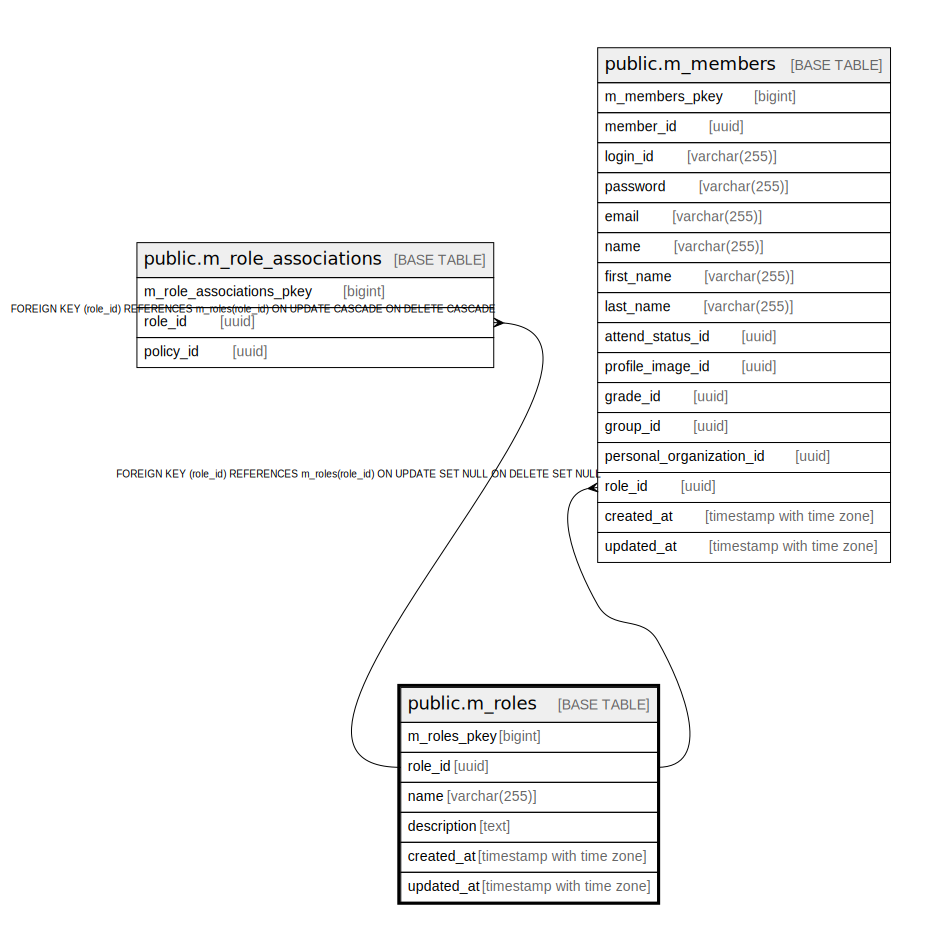

# public.m_roles

## Description

## Columns

| Name | Type | Default | Nullable | Children | Parents | Comment |
| ---- | ---- | ------- | -------- | -------- | ------- | ------- |
| m_roles_pkey | bigint | nextval('m_roles_m_roles_pkey_seq'::regclass) | false |  |  |  |
| role_id | uuid | uuid_generate_v4() | false | [public.m_role_associations](public.m_role_associations.md) [public.m_members](public.m_members.md) |  |  |
| name | varchar(255) |  | false |  |  |  |
| description | text |  | false |  |  |  |
| created_at | timestamp with time zone |  | false |  |  |  |
| updated_at | timestamp with time zone |  | false |  |  |  |

## Constraints

| Name | Type | Definition |
| ---- | ---- | ---------- |
| m_roles_pkey | PRIMARY KEY | PRIMARY KEY (m_roles_pkey) |

## Indexes

| Name | Definition |
| ---- | ---------- |
| m_roles_pkey | CREATE UNIQUE INDEX m_roles_pkey ON public.m_roles USING btree (m_roles_pkey) |
| idx_m_roles_id | CREATE UNIQUE INDEX idx_m_roles_id ON public.m_roles USING btree (role_id) |
| idx_m_roles_name | CREATE INDEX idx_m_roles_name ON public.m_roles USING btree (name) |

## Relations

---

> Generated by [tbls](https://github.com/k1LoW/tbls)
