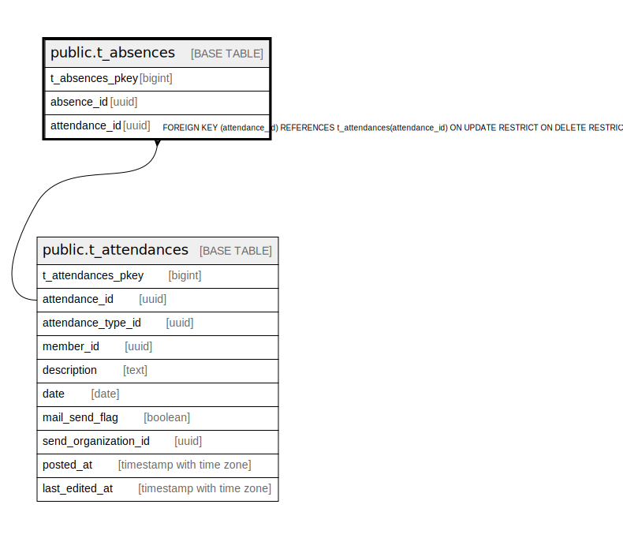

# public.t_absences

## Description

## Columns

| Name | Type | Default | Nullable | Children | Parents | Comment |
| ---- | ---- | ------- | -------- | -------- | ------- | ------- |
| t_absences_pkey | bigint | nextval('t_absences_t_absences_pkey_seq'::regclass) | false |  |  |  |
| absence_id | uuid | uuid_generate_v4() | false |  |  |  |
| attendance_id | uuid |  | false |  | [public.t_attendances](public.t_attendances.md) |  |

## Constraints

| Name | Type | Definition |
| ---- | ---- | ---------- |
| fk_t_absences_attendance_id | FOREIGN KEY | FOREIGN KEY (attendance_id) REFERENCES t_attendances(attendance_id) ON UPDATE RESTRICT ON DELETE RESTRICT |
| t_absences_pkey | PRIMARY KEY | PRIMARY KEY (t_absences_pkey) |

## Indexes

| Name | Definition |
| ---- | ---------- |
| t_absences_pkey | CREATE UNIQUE INDEX t_absences_pkey ON public.t_absences USING btree (t_absences_pkey) |
| idx_t_absences_id | CREATE UNIQUE INDEX idx_t_absences_id ON public.t_absences USING btree (absence_id) |

## Relations

---

> Generated by [tbls](https://github.com/k1LoW/tbls)
