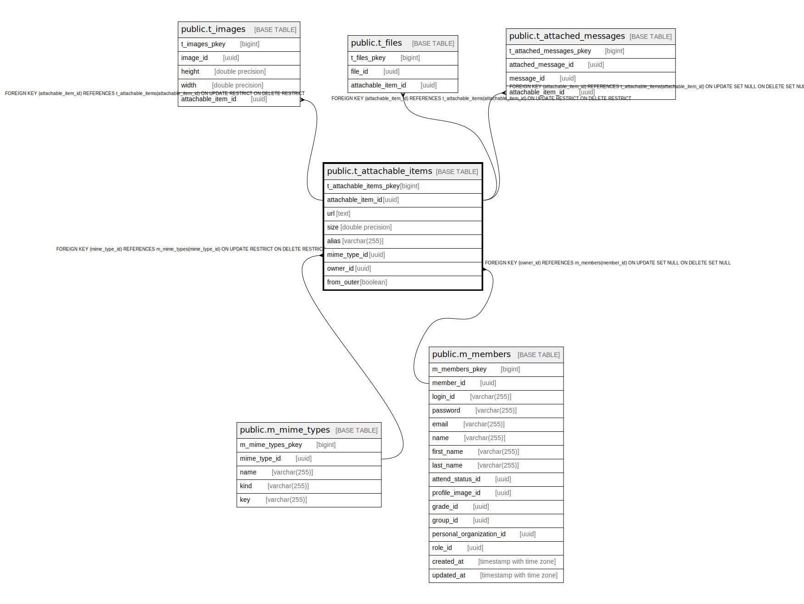

# public.t_attachable_items

## Description

## Columns

| Name | Type | Default | Nullable | Children | Parents | Comment |
| ---- | ---- | ------- | -------- | -------- | ------- | ------- |
| t_attachable_items_pkey | bigint | nextval('t_attachable_items_t_attachable_items_pkey_seq'::regclass) | false |  |  |  |
| attachable_item_id | uuid | uuid_generate_v4() | false | [public.t_images](public.t_images.md) [public.t_files](public.t_files.md) |  |  |
| size | double precision |  | true |  |  |  |
| mime_type_id | uuid |  | false |  | [public.m_mime_types](public.m_mime_types.md) |  |

## Constraints

| Name | Type | Definition |
| ---- | ---- | ---------- |
| fk_t_attachable_items_mime_type_id | FOREIGN KEY | FOREIGN KEY (mime_type_id) REFERENCES m_mime_types(mime_type_id) ON UPDATE RESTRICT ON DELETE RESTRICT |
| t_attachable_items_pkey | PRIMARY KEY | PRIMARY KEY (t_attachable_items_pkey) |

## Indexes

| Name | Definition |
| ---- | ---------- |
| t_attachable_items_pkey | CREATE UNIQUE INDEX t_attachable_items_pkey ON public.t_attachable_items USING btree (t_attachable_items_pkey) |
| idx_t_attachable_items_id | CREATE UNIQUE INDEX idx_t_attachable_items_id ON public.t_attachable_items USING btree (attachable_item_id) |

## Relations

---

> Generated by [tbls](https://github.com/k1LoW/tbls)
