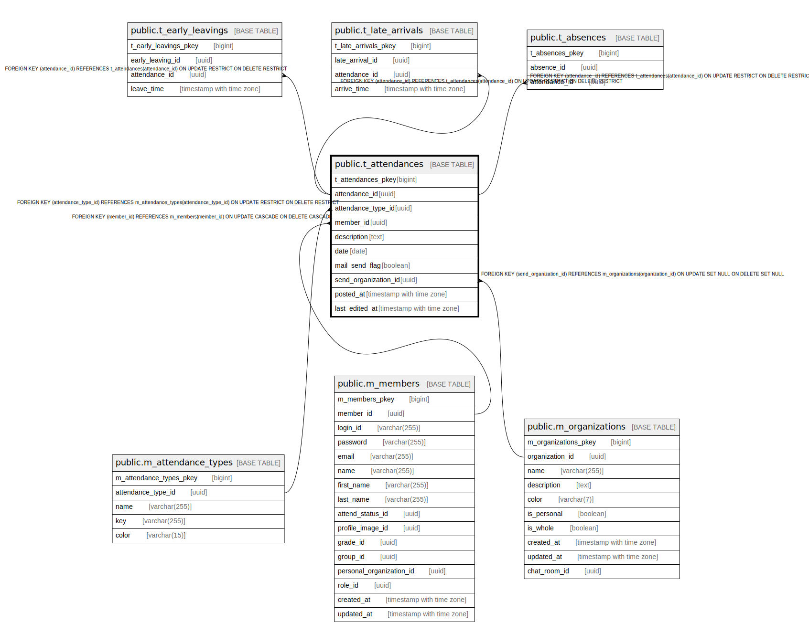

# public.t_attendances

## Description

## Columns

| Name | Type | Default | Nullable | Children | Parents | Comment |
| ---- | ---- | ------- | -------- | -------- | ------- | ------- |
| t_attendances_pkey | bigint | nextval('t_attendances_t_attendances_pkey_seq'::regclass) | false |  |  |  |
| attendance_id | uuid | uuid_generate_v4() | false | [public.t_early_leavings](public.t_early_leavings.md) [public.t_late_arrivals](public.t_late_arrivals.md) [public.t_absences](public.t_absences.md) |  |  |
| attendance_type_id | uuid |  | false |  | [public.m_attendance_types](public.m_attendance_types.md) |  |
| member_id | uuid |  | false |  | [public.m_members](public.m_members.md) |  |
| description | text |  | false |  |  |  |
| date | date |  | false |  |  |  |
| mail_send_flag | boolean |  | false |  |  |  |
| send_organization_id | uuid |  | true |  | [public.m_organizations](public.m_organizations.md) |  |
| posted_at | timestamp with time zone |  | false |  |  |  |
| last_edited_at | timestamp with time zone |  | false |  |  |  |

## Constraints

| Name | Type | Definition |
| ---- | ---- | ---------- |
| fk_t_attendances_send_organization_id | FOREIGN KEY | FOREIGN KEY (send_organization_id) REFERENCES m_organizations(organization_id) ON UPDATE SET NULL ON DELETE SET NULL |
| fk_t_attendances_member_id | FOREIGN KEY | FOREIGN KEY (member_id) REFERENCES m_members(member_id) ON UPDATE CASCADE ON DELETE CASCADE |
| fk_t_attendances_attendance_type_id | FOREIGN KEY | FOREIGN KEY (attendance_type_id) REFERENCES m_attendance_types(attendance_type_id) ON UPDATE RESTRICT ON DELETE RESTRICT |
| t_attendances_pkey | PRIMARY KEY | PRIMARY KEY (t_attendances_pkey) |

## Indexes

| Name | Definition |
| ---- | ---------- |
| t_attendances_pkey | CREATE UNIQUE INDEX t_attendances_pkey ON public.t_attendances USING btree (t_attendances_pkey) |
| idx_t_attendances_id | CREATE UNIQUE INDEX idx_t_attendances_id ON public.t_attendances USING btree (attendance_id) |

## Relations

---

> Generated by [tbls](https://github.com/k1LoW/tbls)
