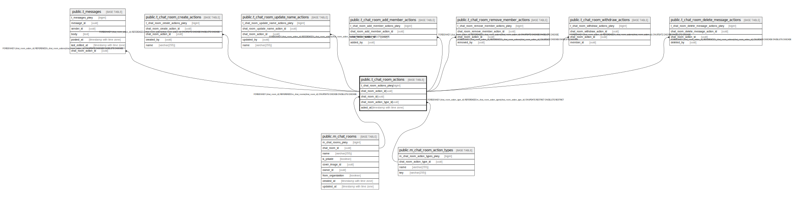

# public.t_chat_room_actions

## Description

## Columns

| Name | Type | Default | Nullable | Children | Parents | Comment |
| ---- | ---- | ------- | -------- | -------- | ------- | ------- |
| t_chat_room_actions_pkey | bigint | nextval('t_chat_room_actions_t_chat_room_actions_pkey_seq'::regclass) | false |  |  |  |
| chat_room_action_id | uuid | uuid_generate_v4() | false | [public.t_messages](public.t_messages.md) [public.t_chat_room_create_actions](public.t_chat_room_create_actions.md) [public.t_chat_room_update_name_actions](public.t_chat_room_update_name_actions.md) [public.t_chat_room_add_member_actions](public.t_chat_room_add_member_actions.md) [public.t_chat_room_remove_member_actions](public.t_chat_room_remove_member_actions.md) [public.t_chat_room_withdraw_actions](public.t_chat_room_withdraw_actions.md) |  |  |
| chat_room_id | uuid |  | false |  | [public.m_chat_rooms](public.m_chat_rooms.md) |  |
| chat_room_action_type_id | uuid |  | false |  | [public.m_chat_room_action_types](public.m_chat_room_action_types.md) |  |
| acted_at | timestamp with time zone |  | false |  |  |  |

## Constraints

| Name | Type | Definition |
| ---- | ---- | ---------- |
| fk_t_chat_room_actions_chat_room_id | FOREIGN KEY | FOREIGN KEY (chat_room_id) REFERENCES m_chat_rooms(chat_room_id) ON UPDATE CASCADE ON DELETE CASCADE |
| fk_t_chat_room_actions_chat_room_action_type_id | FOREIGN KEY | FOREIGN KEY (chat_room_action_type_id) REFERENCES m_chat_room_action_types(chat_room_action_type_id) ON UPDATE RESTRICT ON DELETE RESTRICT |
| t_chat_room_actions_pkey | PRIMARY KEY | PRIMARY KEY (t_chat_room_actions_pkey) |

## Indexes

| Name | Definition |
| ---- | ---------- |
| t_chat_room_actions_pkey | CREATE UNIQUE INDEX t_chat_room_actions_pkey ON public.t_chat_room_actions USING btree (t_chat_room_actions_pkey) |
| idx_t_chat_room_actions_id | CREATE UNIQUE INDEX idx_t_chat_room_actions_id ON public.t_chat_room_actions USING btree (chat_room_action_id) |

## Relations

---

> Generated by [tbls](https://github.com/k1LoW/tbls)
