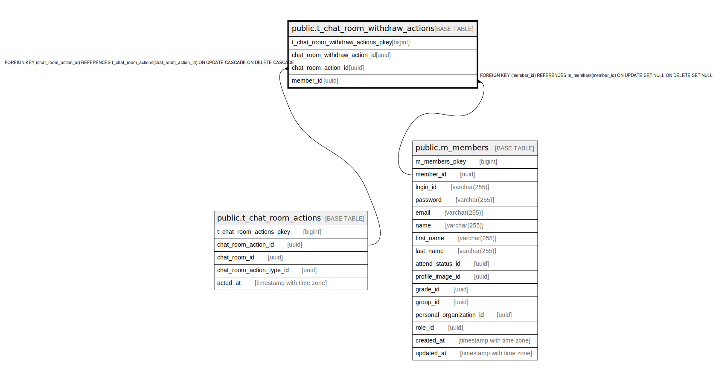

# public.t_chat_room_withdraw_actions

## Description

## Columns

| Name | Type | Default | Nullable | Children | Parents | Comment |
| ---- | ---- | ------- | -------- | -------- | ------- | ------- |
| t_chat_room_withdraw_actions_pkey | bigint | nextval('t_chat_room_withdraw_actions_t_chat_room_withdraw_actions_p_seq'::regclass) | false |  |  |  |
| chat_room_withdraw_action_id | uuid | uuid_generate_v4() | false |  |  |  |
| chat_room_action_id | uuid |  | false |  | [public.t_chat_room_actions](public.t_chat_room_actions.md) |  |
| member_id | uuid |  | true |  | [public.m_members](public.m_members.md) |  |

## Constraints

| Name | Type | Definition |
| ---- | ---- | ---------- |
| fk_t_chat_room_withdraw_actions_member_id | FOREIGN KEY | FOREIGN KEY (member_id) REFERENCES m_members(member_id) ON UPDATE SET NULL ON DELETE SET NULL |
| fk_t_chat_room_withdraw_actions_chat_room_action_id | FOREIGN KEY | FOREIGN KEY (chat_room_action_id) REFERENCES t_chat_room_actions(chat_room_action_id) ON UPDATE RESTRICT ON DELETE RESTRICT |
| t_chat_room_withdraw_actions_pkey | PRIMARY KEY | PRIMARY KEY (t_chat_room_withdraw_actions_pkey) |

## Indexes

| Name | Definition |
| ---- | ---------- |
| t_chat_room_withdraw_actions_pkey | CREATE UNIQUE INDEX t_chat_room_withdraw_actions_pkey ON public.t_chat_room_withdraw_actions USING btree (t_chat_room_withdraw_actions_pkey) |
| idx_t_chat_room_withdraw_actions_id | CREATE UNIQUE INDEX idx_t_chat_room_withdraw_actions_id ON public.t_chat_room_withdraw_actions USING btree (chat_room_withdraw_action_id) |

## Relations

---

> Generated by [tbls](https://github.com/k1LoW/tbls)
