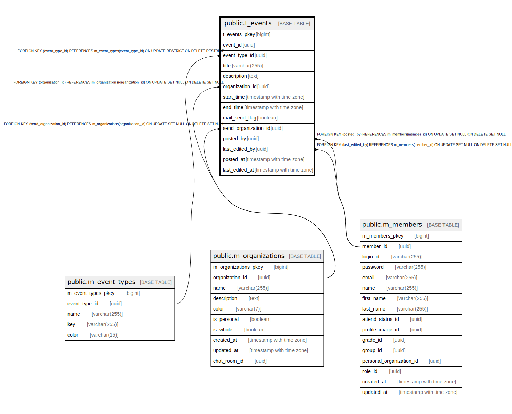

# public.t_events

## Description

## Columns

| Name | Type | Default | Nullable | Children | Parents | Comment |
| ---- | ---- | ------- | -------- | -------- | ------- | ------- |
| t_events_pkey | bigint | nextval('t_events_t_events_pkey_seq'::regclass) | false |  |  |  |
| event_id | uuid | uuid_generate_v4() | false |  |  |  |
| event_type_id | uuid |  | false |  | [public.m_event_types](public.m_event_types.md) |  |
| title | varchar(255) |  | false |  |  |  |
| description | text |  | true |  |  |  |
| organization_id | uuid |  | true |  | [public.m_organizations](public.m_organizations.md) |  |
| start_time | timestamp with time zone |  | false |  |  |  |
| end_time | timestamp with time zone |  | false |  |  |  |
| mail_send_flag | boolean |  | false |  |  |  |
| send_organization_id | uuid |  | true |  | [public.m_organizations](public.m_organizations.md) |  |
| posted_by | uuid |  | true |  | [public.m_members](public.m_members.md) |  |
| last_edited_by | uuid |  | true |  | [public.m_members](public.m_members.md) |  |
| posted_at | timestamp with time zone |  | false |  |  |  |
| last_edited_at | timestamp with time zone |  | false |  |  |  |

## Constraints

| Name | Type | Definition |
| ---- | ---- | ---------- |
| fk_t_events_organization_id | FOREIGN KEY | FOREIGN KEY (organization_id) REFERENCES m_organizations(organization_id) ON UPDATE SET NULL ON DELETE SET NULL |
| fk_t_events_send_organization_id | FOREIGN KEY | FOREIGN KEY (send_organization_id) REFERENCES m_organizations(organization_id) ON UPDATE SET NULL ON DELETE SET NULL |
| fk_t_events_last_edited_by | FOREIGN KEY | FOREIGN KEY (last_edited_by) REFERENCES m_members(member_id) ON UPDATE SET NULL ON DELETE SET NULL |
| fk_t_events_posted_by | FOREIGN KEY | FOREIGN KEY (posted_by) REFERENCES m_members(member_id) ON UPDATE SET NULL ON DELETE SET NULL |
| fk_t_events_event_type_id | FOREIGN KEY | FOREIGN KEY (event_type_id) REFERENCES m_event_types(event_type_id) ON UPDATE RESTRICT ON DELETE RESTRICT |
| t_events_pkey | PRIMARY KEY | PRIMARY KEY (t_events_pkey) |

## Indexes

| Name | Definition |
| ---- | ---------- |
| t_events_pkey | CREATE UNIQUE INDEX t_events_pkey ON public.t_events USING btree (t_events_pkey) |
| idx_t_events_id | CREATE UNIQUE INDEX idx_t_events_id ON public.t_events USING btree (event_id) |

## Relations

---

> Generated by [tbls](https://github.com/k1LoW/tbls)
