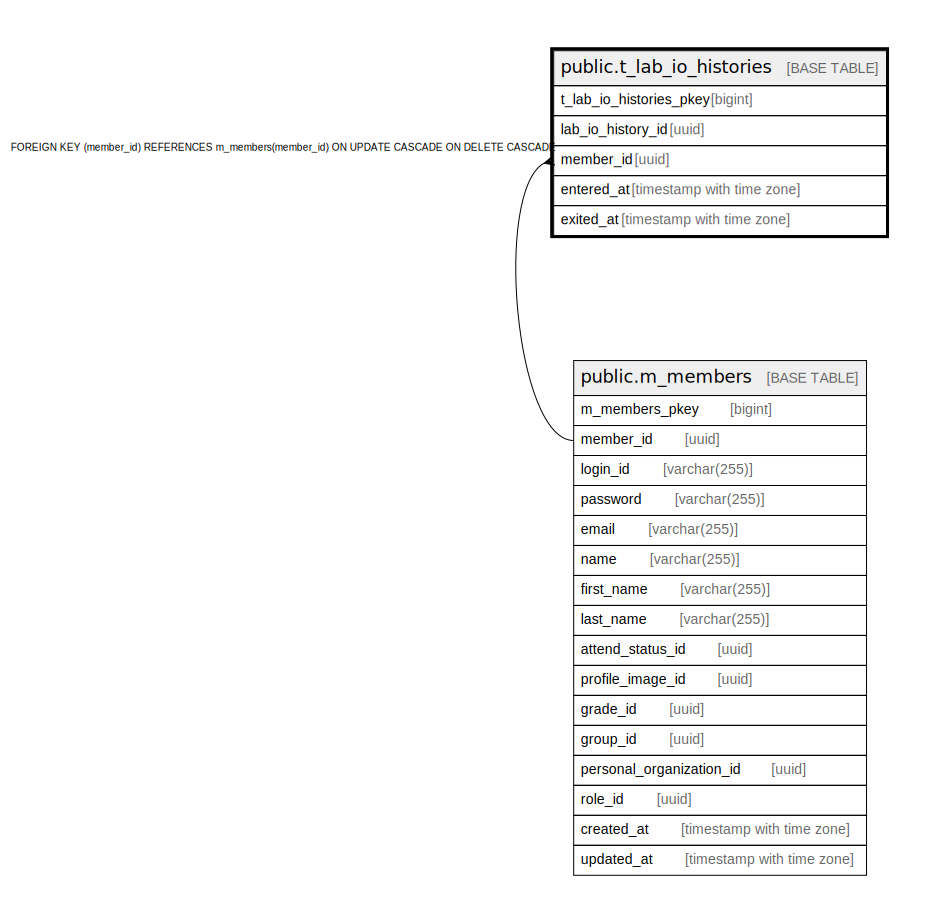

# public.t_lab_io_histories

## Description

## Columns

| Name | Type | Default | Nullable | Children | Parents | Comment |
| ---- | ---- | ------- | -------- | -------- | ------- | ------- |
| t_lab_io_histories_pkey | bigint | nextval('t_lab_io_histories_t_lab_io_histories_pkey_seq'::regclass) | false |  |  |  |
| lab_io_history_id | uuid | uuid_generate_v4() | false |  |  |  |
| member_id | uuid |  | false |  | [public.m_members](public.m_members.md) |  |
| entered_at | timestamp with time zone |  | false |  |  |  |
| exited_at | timestamp with time zone |  | true |  |  |  |

## Constraints

| Name | Type | Definition |
| ---- | ---- | ---------- |
| fk_t_lab_io_histories_member_id | FOREIGN KEY | FOREIGN KEY (member_id) REFERENCES m_members(member_id) ON UPDATE CASCADE ON DELETE CASCADE |
| t_lab_io_histories_pkey | PRIMARY KEY | PRIMARY KEY (t_lab_io_histories_pkey) |

## Indexes

| Name | Definition |
| ---- | ---------- |
| t_lab_io_histories_pkey | CREATE UNIQUE INDEX t_lab_io_histories_pkey ON public.t_lab_io_histories USING btree (t_lab_io_histories_pkey) |
| idx_t_lab_io_histories_id | CREATE UNIQUE INDEX idx_t_lab_io_histories_id ON public.t_lab_io_histories USING btree (lab_io_history_id) |

## Relations

---

> Generated by [tbls](https://github.com/k1LoW/tbls)
