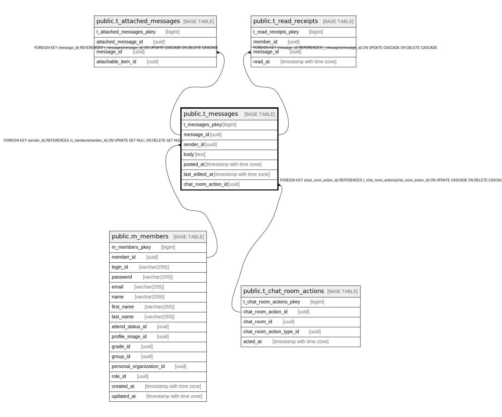

# public.t_messages

## Description

## Columns

| Name | Type | Default | Nullable | Children | Parents | Comment |
| ---- | ---- | ------- | -------- | -------- | ------- | ------- |
| t_messages_pkey | bigint | nextval('t_messages_t_messages_pkey_seq'::regclass) | false |  |  |  |
| message_id | uuid | uuid_generate_v4() | false |  |  |  |
| chat_room_id | uuid |  | false |  | [public.m_chat_rooms](public.m_chat_rooms.md) |  |
| sender_id | uuid |  | true |  | [public.m_members](public.m_members.md) |  |
| body | text |  | false |  |  |  |
| posted_at | timestamp with time zone |  | false |  |  |  |
| last_edited_at | timestamp with time zone |  | false |  |  |  |

## Constraints

| Name | Type | Definition |
| ---- | ---- | ---------- |
| fk_t_messages_sender_id | FOREIGN KEY | FOREIGN KEY (sender_id) REFERENCES m_members(member_id) ON UPDATE SET NULL ON DELETE SET NULL |
| fk_t_messages_chat_room_id | FOREIGN KEY | FOREIGN KEY (chat_room_id) REFERENCES m_chat_rooms(chat_room_id) ON UPDATE CASCADE ON DELETE CASCADE |
| t_messages_pkey | PRIMARY KEY | PRIMARY KEY (t_messages_pkey) |

## Indexes

| Name | Definition |
| ---- | ---------- |
| t_messages_pkey | CREATE UNIQUE INDEX t_messages_pkey ON public.t_messages USING btree (t_messages_pkey) |
| idx_t_messages_id | CREATE UNIQUE INDEX idx_t_messages_id ON public.t_messages USING btree (message_id) |

## Relations

---

> Generated by [tbls](https://github.com/k1LoW/tbls)
