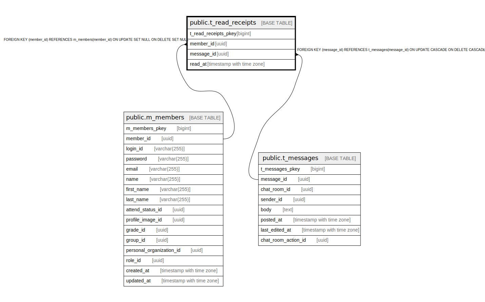

# public.t_read_receipts

## Description

## Columns

| Name | Type | Default | Nullable | Children | Parents | Comment |
| ---- | ---- | ------- | -------- | -------- | ------- | ------- |
| t_read_receipts_pkey | bigint | nextval('t_read_receipts_t_read_receipts_pkey_seq'::regclass) | false |  |  |  |
| member_id | uuid |  | false |  | [public.m_members](public.m_members.md) |  |
| message_id | uuid |  | false |  | [public.t_messages](public.t_messages.md) |  |
| read_at | timestamp with time zone |  | true |  |  |  |

## Constraints

| Name | Type | Definition |
| ---- | ---- | ---------- |
| fk_t_read_receipts_member_id | FOREIGN KEY | FOREIGN KEY (member_id) REFERENCES m_members(member_id) ON UPDATE SET NULL ON DELETE SET NULL |
| fk_t_read_receipts_message_id | FOREIGN KEY | FOREIGN KEY (message_id) REFERENCES t_messages(message_id) ON UPDATE CASCADE ON DELETE CASCADE |
| t_read_receipts_pkey | PRIMARY KEY | PRIMARY KEY (t_read_receipts_pkey) |

## Indexes

| Name | Definition |
| ---- | ---------- |
| t_read_receipts_pkey | CREATE UNIQUE INDEX t_read_receipts_pkey ON public.t_read_receipts USING btree (t_read_receipts_pkey) |
| idx_t_read_receipts_id | CREATE UNIQUE INDEX idx_t_read_receipts_id ON public.t_read_receipts USING btree (member_id, message_id) |

## Relations

---

> Generated by [tbls](https://github.com/k1LoW/tbls)
