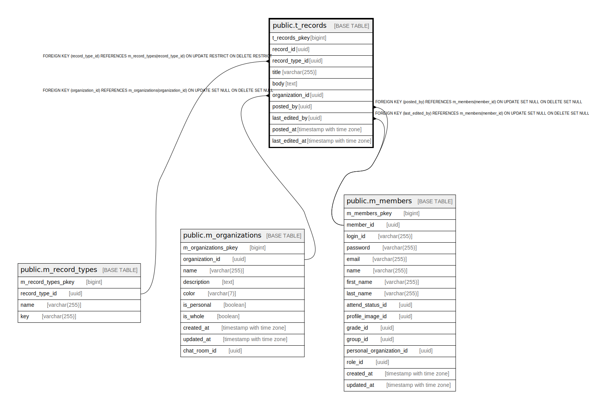

# public.t_records

## Description

## Columns

| Name | Type | Default | Nullable | Children | Parents | Comment |
| ---- | ---- | ------- | -------- | -------- | ------- | ------- |
| t_records_pkey | bigint | nextval('t_records_t_records_pkey_seq'::regclass) | false |  |  |  |
| record_id | uuid | uuid_generate_v4() | false |  |  |  |
| record_type_id | uuid |  | false |  | [public.m_record_types](public.m_record_types.md) |  |
| title | varchar(255) |  | false |  |  |  |
| body | text |  | true |  |  |  |
| organization_id | uuid |  | true |  | [public.m_organizations](public.m_organizations.md) |  |
| posted_by | uuid |  | true |  | [public.m_members](public.m_members.md) |  |
| last_edited_by | uuid |  | true |  | [public.m_members](public.m_members.md) |  |
| posted_at | timestamp with time zone |  | false |  |  |  |
| last_edited_at | timestamp with time zone |  | false |  |  |  |

## Constraints

| Name | Type | Definition |
| ---- | ---- | ---------- |
| fk_t_records_organization_id | FOREIGN KEY | FOREIGN KEY (organization_id) REFERENCES m_organizations(organization_id) ON UPDATE SET NULL ON DELETE SET NULL |
| fk_t_records_last_edited_by | FOREIGN KEY | FOREIGN KEY (last_edited_by) REFERENCES m_members(member_id) ON UPDATE SET NULL ON DELETE SET NULL |
| fk_t_records_posted_by | FOREIGN KEY | FOREIGN KEY (posted_by) REFERENCES m_members(member_id) ON UPDATE SET NULL ON DELETE SET NULL |
| fk_t_records_record_type_id | FOREIGN KEY | FOREIGN KEY (record_type_id) REFERENCES m_record_types(record_type_id) ON UPDATE RESTRICT ON DELETE RESTRICT |
| t_records_pkey | PRIMARY KEY | PRIMARY KEY (t_records_pkey) |

## Indexes

| Name | Definition |
| ---- | ---------- |
| t_records_pkey | CREATE UNIQUE INDEX t_records_pkey ON public.t_records USING btree (t_records_pkey) |
| idx_t_records_id | CREATE UNIQUE INDEX idx_t_records_id ON public.t_records USING btree (record_id) |

## Relations

---

> Generated by [tbls](https://github.com/k1LoW/tbls)
